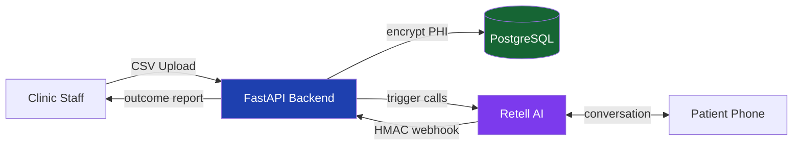

# CallCenterAI — HEDIS Outreach Automation Platform

[](https://github.com/EdgarJSuarez/CallCenterAI/actions/workflows/ci.yml)
[](https://www.python.org/downloads/release/python-311/)
[](https://fastapi.tiangolo.com/)
[](https://www.postgresql.org/)
[](https://www.docker.com/)
[](#phi-security)

A multi-tenant SaaS platform that automates HEDIS care-gap outreach for primary care clinics. Clinics upload a CSV of patients; the system places AI voice calls via **Retell AI**, records each patient's response, and generates an outcome report — without staff intervention.

> Built with FastAPI + PostgreSQL + AES-256-GCM PHI encryption. Designed for HIPAA compliance (Azure BAA in scope).

---

## Architecture



See [`docs/architecture/`](docs/architecture/) for detailed Mermaid diagrams:
- [System overview](docs/architecture/system-overview.md)
- [Call flow sequence](docs/architecture/call-flow.md)
- [Database ERD](docs/architecture/database-erd.md)
- [PHI encryption flow](docs/architecture/phi-encryption.md)
- [Multi-tenancy isolation](docs/architecture/multi-tenancy.md)

---

## What This Solves

Primary care clinics enrolled in value-based contracts receive monthly care-gap reports (HEDIS measures — A1C, mammograms, annual wellness visits). Acting on these lists requires staff to manually call hundreds of patients — a process that takes days.

**Fewer than 40% of HEDIS care gaps get closed** due to staff bandwidth constraints. For a clinic earning $40–$80 per closed gap, automating outreach from 40% → 80% on 500 patients = **$8,000–$16,000 in additional reimbursement per cycle**.

---

## Features

### Implemented
- **Outbound campaign engine** — create campaigns, upload patient CSVs, process contacts via AI voice agent
- **HIPAA-compliant PHI handling** — patient names and phones encrypted at rest (AES-256-GCM), never logged in plaintext
- **Multi-tenant isolation** — row-level `clinic_id` scoping on every table and query
- **Phone dedup via SHA-256** — deduplication without decryption
- **Outcome recording** — ACCEPTED / DECLINED / VOICEMAIL / NO_ANSWER / FAILED per contact
- **Campaign outcome report** — decrypted names, masked phones, call dates, durations
- **Background campaign worker** — asyncio task, polls for QUEUED campaigns, respects business hours
- **Demo mode** — simulates call outcomes locally when `RETELL_API_KEY` is not set
- **Admin API** — clinic, license, and integration CRUD (API key protected)
- **HMAC-SHA256 webhook verification** — all Retell webhooks signature-verified
- **Async pytest test suite** — unit coverage of encryption, campaign service, auth, availability, booking

### Phase 2 (Designed, Not Yet Activated)
- **GCal-integrated booking engine** — inbound scheduling with tentative holds, confirm/cancel/reschedule
- **NextGen EHR automation** — server-side Playwright + AgentQL to read live availability and book mid-call
- **Google OAuth staff login** — JWT-scoped per clinic
- **Redis selector cache** — 24h TTL caching of AgentQL selectors (~60% token savings)

---

## Tech Stack

| Layer | Technology | Why |
|-------|-----------|-----|
| API Framework | FastAPI 0.115.6 (async) | Native async, OpenAPI auto-docs, type safety |
| ORM | SQLAlchemy 2.0 async + asyncpg | True async DB — no thread pool blocking |
| Migrations | Alembic | Schema version control |
| Database | PostgreSQL 15 | JSONB for features, row-level isolation |
| Encryption | AES-256-GCM via `cryptography` | FIPS 140-2, tamper-evident auth tag |
| Voice AI | Retell AI | Sub-200ms latency, tool calling, bilingual |
| Background Jobs | asyncio tasks | No Celery/Redis dependency for MVP |
| Container | Docker + docker-compose | Dev parity, one-command startup |
| Hosting | Azure (HIPAA BAA in effect) | BAA required for PHI |

---

## Quick Start

```bash
# 1. Clone and configure
git clone https://github.com/EdgarJSuarez/CallCenterAI.git && cd CallCenterAI
cp env.example .env
# Edit .env: set DB_PASSWORD, PHI_ENCRYPTION_KEY, ADMIN_API_KEY

# 2. Start services (app + postgres + redis)
docker compose -f docker-compose.dev.yaml up

# 3. Load demo data
python scripts/seed_demo.py

# 4. Open Swagger UI
open http://localhost:8000/docs

# 5. Run the demo walkthrough
export CLINIC_ID=<id from seed output>
export ADMIN_API_KEY=<your key>
bash scripts/demo_walkthrough.sh
```

---

## API Endpoints

### Campaigns (`X-API-Key` required)

| Method | Path | Description |
|--------|------|-------------|
| `POST` | `/admin/clinics/{id}/campaigns` | Create campaign |
| `GET` | `/admin/clinics/{id}/campaigns` | List campaigns |
| `GET` | `/admin/clinics/{id}/campaigns/{cid}` | Get campaign |
| `POST` | `/admin/clinics/{id}/campaigns/{cid}/upload` | Upload patient CSV |
| `POST` | `/admin/clinics/{id}/campaigns/{cid}/start` | Start campaign |
| `POST` | `/admin/clinics/{id}/campaigns/{cid}/pause` | Pause campaign |
| `POST` | `/admin/clinics/{id}/campaigns/{cid}/process-next` | **[Demo]** Simulate next call |
| `GET` | `/admin/clinics/{id}/campaigns/{cid}/report` | Outcome report |

### Clinic Admin (`X-API-Key` required)

| Method | Path | Description |
|--------|------|-------------|
| `POST` | `/admin/clinics/setup` | Atomic clinic + integration creation |
| `GET/PUT` | `/admin/clinics/{id}` | Clinic CRUD |
| `GET/PUT` | `/admin/clinics/{id}/integration` | Retell integration |
| `GET/PUT` | `/admin/clinics/{id}/business-hours` | Calling hours config |

### Retell Webhooks (HMAC-verified)

| Method | Path | Description |
|--------|------|-------------|
| `POST` | `/retell/webhook/call_started` | Call start — create call log |
| `POST` | `/retell/webhook/call_ended` | Call end — record outcome |

---

## PHI Security

Patient data is never stored in plaintext. The encryption pipeline:

```
Plaintext (in-memory only)
    ↓ encrypt_phi() — AES-256-GCM
    ↓ IV(12B) + ciphertext + auth_tag(16B)
    ↓ BYTEA column in PostgreSQL
```

- **Phone hash** — SHA-256 of E.164 phone, used for O(1) dedup without decryption
- **Phones in logs** — masked as `***-***-XXXX`
- **Call transcripts** — never stored; outcome recorded as one-sentence note
- **Auth tag** — tamper detection on every decryption (`AuthenticationError` on failure)

See [`docs/architecture/phi-encryption.md`](docs/architecture/phi-encryption.md) for the full flow diagram.

---

## Running Tests

```bash
# Unit tests only (no DB required)
pytest tests/ -m unit -v

# All tests
pytest tests/ -v
```

---

## Project Structure

```
CallCenterAI/
├── Clinic_app/
│   ├── main.py                  # App factory — routers, CORS, lifespan
│   ├── common/
│   │   ├── auth.py              # Admin API key dependency
│   │   ├── database.py          # Async SQLAlchemy engine
│   │   ├── encryption.py        # AES-256-GCM — all PHI goes through here
│   │   └── schemas.py           # Shared Pydantic models
│   ├── data/
│   │   ├── enums.py             # All domain enumerations
│   │   └── models/              # 12 SQLAlchemy ORM models
│   ├── Routes/
│   │   ├── campaign.py          # Campaign endpoints (active — demo mode)
│   │   ├── admin.py             # Clinic/license/integration CRUD
│   │   ├── retell.py            # Webhook handlers + Phase 2 booking tools
│   │   └── health.py            # Health check
│   ├── services/
│   │   ├── campaign.py          # Campaign business logic + demo simulation
│   │   ├── booking.py           # Booking lifecycle (Phase 2)
│   │   ├── availability.py      # Slot engine (Phase 2)
│   │   ├── google_calendar.py   # GCal integration (Phase 2)
│   │   └── patient.py           # PHI-encrypted patient CRUD
│   ├── workers/
│   │   └── campaign_worker.py   # Background campaign processor
│   └── alembic/                 # DB migrations
├── dashboard/                   # React SPA (Vite + Tailwind)
├── docs/architecture/           # Mermaid diagrams
├── scripts/
│   ├── seed_demo.py             # Demo data seeder
│   └── demo_walkthrough.sh      # curl-based demo script
├── tests/                       # Async pytest suite
├── agentql-test/                # Playwright + AgentQL validation scripts
├── Dockerfile
├── docker-compose.yaml          # Production
├── docker-compose.dev.yaml      # Dev (app + postgres + redis)
└── env.example
```

---

## System Design Deep Dive

The `Retell_SYSTEM_DESIGN_REPORT.md` contains a senior-engineer-level breakdown covering:
- Problem framing and unit economics
- Data model rationale (why 12 tables, not 5)
- PHI security model and HIPAA mapping
- Multi-tenancy architecture trade-offs
- Booking lifecycle state machine
- Voice AI integration patterns
- Background job architecture
- Known gaps and technical debt

Recommended reading before a system design interview conversation.

---

## Author

**Edgar J. Suárez Colón** — Software Engineer
U.S. Air Force Palace Acquire (PAQ) Program, May 2026
[GitHub](https://github.com/EdgarJSuarez) | [LinkedIn](https://linkedin.com/in/edgarjsuarez)
