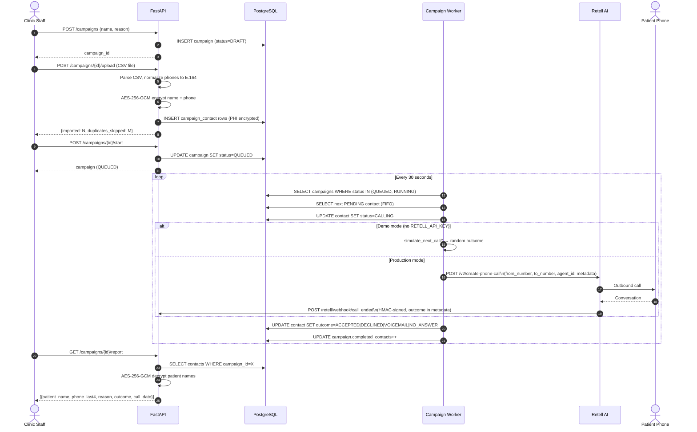
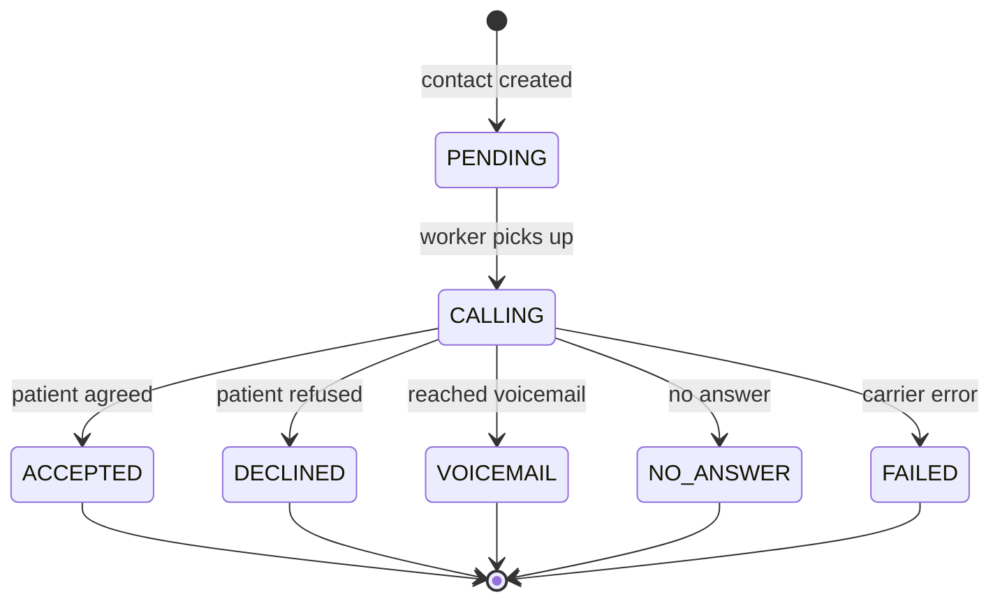

# Outbound Campaign Call Flow

Sequence diagram showing one contact's lifecycle from CSV upload to outcome report.

```mermaid
sequenceDiagram
    autonumber
    actor Staff as Clinic Staff
    participant API as FastAPI
    participant DB as PostgreSQL
    participant Worker as Campaign Worker
    participant Retell as Retell AI
    actor Patient as Patient Phone

    Staff->>API: POST /campaigns (name, reason)
    API->>DB: INSERT campaign (status=DRAFT)
    API-->>Staff: campaign_id

    Staff->>API: POST /campaigns/{id}/upload (CSV file)
    API->>API: Parse CSV, normalize phones to E.164
    API->>API: AES-256-GCM encrypt name + phone
    API->>DB: INSERT campaign_contact rows (PHI encrypted)
    API-->>Staff: {imported: N, duplicates_skipped: M}

    Staff->>API: POST /campaigns/{id}/start
    API->>DB: UPDATE campaign SET status=QUEUED
    API-->>Staff: campaign (QUEUED)

    loop Every 30 seconds
        Worker->>DB: SELECT campaigns WHERE status IN (QUEUED, RUNNING)
        Worker->>DB: SELECT next PENDING contact (FIFO)
        Worker->>DB: UPDATE contact SET status=CALLING

        alt Demo mode (no RETELL_API_KEY)
            Worker->>Worker: simulate_next_call() → random outcome
        else Production mode
            Worker->>Retell: POST /v2/create-phone-call\n(from_number, to_number, agent_id, metadata)
            Retell->>Patient: Outbound call
            Patient-->>Retell: Conversation
            Retell->>API: POST /retell/webhook/call_ended\n(HMAC-signed, outcome in metadata)
        end

        Worker->>DB: UPDATE contact SET outcome=ACCEPTED|DECLINED|VOICEMAIL|NO_ANSWER
        Worker->>DB: UPDATE campaign.completed_contacts++
    end

    Staff->>API: GET /campaigns/{id}/report
    API->>DB: SELECT contacts WHERE campaign_id=X
    API->>API: AES-256-GCM decrypt patient names
    API-->>Staff: [{patient_name, phone_last4, reason, outcome, call_date}]
```

## Outcome State Machine

```mermaid
stateDiagram-v2
    [*] --> PENDING : contact created
    PENDING --> CALLING : worker picks up
    CALLING --> ACCEPTED : patient agreed
    CALLING --> DECLINED : patient refused
    CALLING --> VOICEMAIL : reached voicemail
    CALLING --> NO_ANSWER : no answer
    CALLING --> FAILED : carrier error
    ACCEPTED --> [*]
    DECLINED --> [*]
    VOICEMAIL --> [*]
    NO_ANSWER --> [*]
    FAILED --> [*]
```
