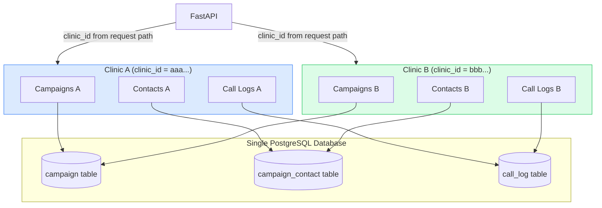

# Multi-Tenancy Architecture

CallCenterAI uses a **shared-schema, row-level tenant isolation** model.
Every clinic is a distinct tenant. All tables include `clinic_id` as a non-nullable
column, and every query filters on it.

## Tenant Isolation Diagram



## Isolation Rules

| Rule | Implementation |
|------|----------------|
| Every query includes `clinic_id` | All service functions take `clinic_id: UUID` parameter |
| Route paths encode `clinic_id` | `/admin/clinics/{clinic_id}/campaigns` |
| Admin auth is global (not per-clinic) | `X-API-Key` is a system-wide admin key |
| Retell webhook maps agent → clinic | `ClinicIntegration.retell_agent_id` → `clinic_id` lookup |
| PHI encryption key is global (v1) | Per-clinic key rotation is Phase 2 |

## Per-Clinic Configuration

Each clinic has its own:
- `ClinicIntegration` — Retell agent ID, DID, (Phase 2) NextGen credentials
- `License` — tier, concurrency limits, feature flags
- `Campaign` records — scoped to clinic
- Business hours — configurable per clinic

## Indexes Supporting Isolation

```sql
-- Every high-traffic table has (clinic_id, ...) composite index
CREATE INDEX idx_campaign_clinic_status       ON campaign (clinic_id, status);
CREATE INDEX idx_campaign_contact_clinic_camp  ON campaign_contact (clinic_id, campaign_id);
CREATE INDEX idx_campaign_contact_phone_hash   ON campaign_contact (clinic_id, phone_hash);
```
