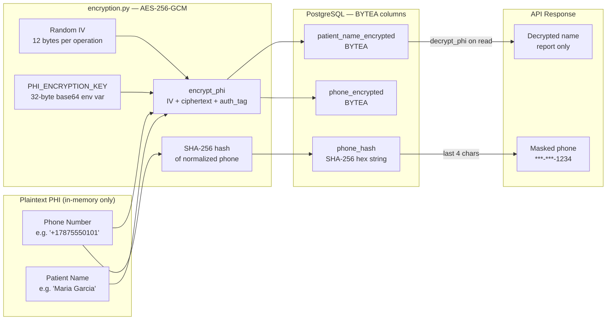

# PHI Encryption Architecture

All Protected Health Information (PHI) is encrypted at rest using AES-256-GCM
as required under HIPAA §164.312(a)(2)(iv).

## Encryption Flow



## Storage Format

```
Encrypted bytes layout:
┌──────────────────────────────────────────────────┐
│  IV (12 bytes)  │  Ciphertext (N bytes)  │  Tag (16 bytes)  │
└──────────────────────────────────────────────────┘

Key: AESGCM(PHI_ENCRYPTION_KEY, nonce=IV)
Tag: GCM authentication tag — tamper-evident
```

## What Is Never Stored in Plaintext

| PHI Field | Storage | Notes |
|-----------|---------|-------|
| Patient name | AES-256-GCM BYTEA | Decrypted only for report display |
| Phone number | AES-256-GCM BYTEA | Masked in all API responses |
| Phone hash | SHA-256 hex | Used for dedup only, not reversible |
| Call transcripts | Never stored | Discarded after call ends |
| Patient DOB | Never stored | Passed to Retell as call metadata only |

## Implementation

- `Clinic_app/common/encryption.py` — `encrypt_phi()` / `decrypt_phi()`
- `cryptography` library — FIPS 140-2 compliant
- Key loading: base64-encoded 32-byte key from `PHI_ENCRYPTION_KEY` env var
- Auth tag verification on every decrypt — raises `AuthenticationError` on tamper
- Logs: phone numbers masked as `***-***-XXXX`, never logged in plaintext
