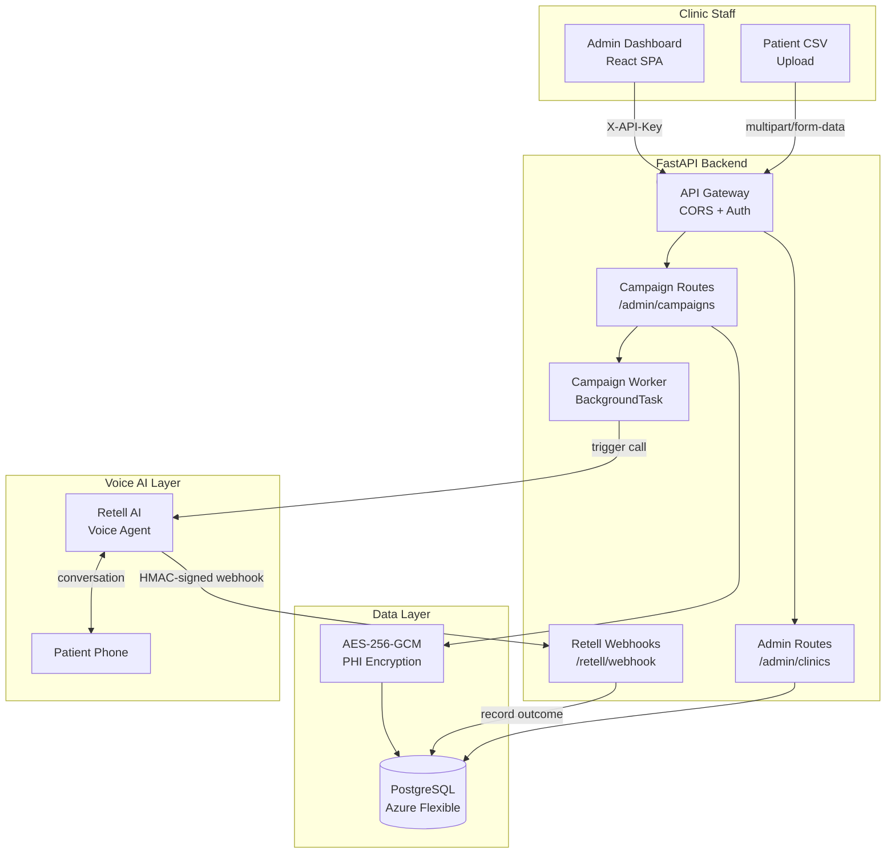

# System Architecture Overview

CallCenterAI is a multi-tenant SaaS platform that automates HEDIS care-gap outreach.

## Key Design Decisions

| Decision | Rationale |
|----------|-----------|
| One Retell agent per clinic | Avoids per-patient-per-gap-type agent sprawl; gap context passed as call metadata |
| AES-256-GCM for all PHI at rest | HIPAA §164.312(a)(2)(iv) — encryption of ePHI in storage |
| SHA-256 phone hash for dedup | Dedup check without decryption — O(1) lookup, no PHI exposure |
| `clinic_id` on every table | Row-level tenant isolation — no ORM-level multi-tenancy magic |
| Async FastAPI + asyncpg | Single-process handles 100+ concurrent webhook callbacks |
| Demo mode (no paid API) | Simulates call outcomes locally for dev/demo without Retell costs |
