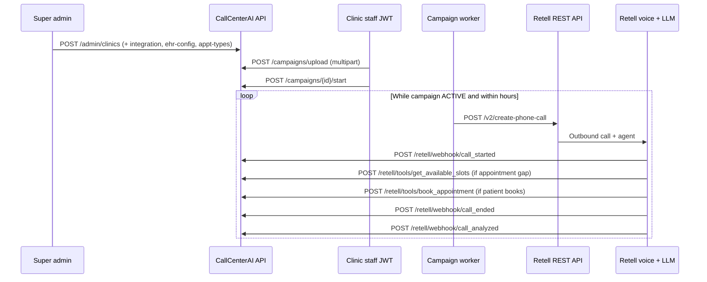

# Retell agent playbook — CallCenterAI (HEDIS campaigns)

Operational guide for wiring **one Retell agent per clinic** to this FastAPI app: onboarding APIs, outbound campaign calls, mid-call EHR tools, webhooks, agent scripts, and post-call analysis.

**Source of truth in code:** `Clinic_app/Routes/retell.py`, `Clinic_app/Routes/campaigns.py`, `Clinic_app/Routes/admin.py`, `Clinic_app/services/retell_client.py`, `Clinic_app/workers/campaign_worker.py`, `Clinic_app/data/enums.py`.

---

## Table of contents

1. [Architecture rules](#1-architecture-rules-non-negotiable)  
2. [Environment variables](#2-environment-variables)  
3. [Public base URL](#3-public-base-url-app_base_url)  
4. [End-to-end workflow](#4-end-to-end-workflow)  
5. [HTTP routes — full catalog](#5-http-routes--full-catalog)  
6. [Outbound API — Retell `create-phone-call`](#6-outbound-api--retell-create-phone-call)  
7. [Metadata and dynamic variables](#7-metadata-and-dynamic-variables-hedis-campaigns)  
8. [Gap types](#8-gap-types-gaptype-enum--plan-013)  
9. [Custom tools — contract + JSON examples](#9-custom-tools--contract--json-examples)  
10. [Webhooks](#10-webhook-behavior-hedis)  
11. [Agent scripts and master prompt](#11-agent-scripts-and-master-prompt)  
12. [Retell dashboard configuration](#12-retell-dashboard-configuration-checklist)  
13. [Verification flow](#13-verification-flow-staging)  
14. [Decisions (Edgar)](#14-decisions-edgar)  
15. [E2E gate (local)](#15-e2e-gate-local--plan-014-sprint-c)

---

## 1. Architecture rules (non-negotiable)

| Rule | Detail |
|------|--------|
| Agents | **One Retell agent per clinic.** `ClinicIntegration.retell_agent_id` must match the agent Retell runs for that clinic. |
| Gap type | Passed on every outbound call as **metadata** (`gap_type`). The agent prompt branches script and tools from this value. **Do not** create separate Retell agents per gap type. |
| HEDIS vs legacy | **HEDIS outbound campaigns** use **`/retell/tools/*`** and **`/retell/webhook/*`**. Legacy routes **`/retell/schedule`**, **`/retell/confirm_booking`**, **`/retell/availability`** are **Google Calendar**, not NextGen Playwright. |

---

## 2. Environment variables

| Variable | Purpose |
|----------|---------|
| `RETELL_API_KEY` | Bearer token for `POST https://api.retellai.com/v2/create-phone-call` (campaign worker). |
| `RETELL_WEBHOOK_SECRET` | HMAC secret for incoming webhooks and tool requests (`x-retell-signature`). |
| `RETELL_FROM_NUMBER` | Default outbound caller ID (E.164). Overridden by `ClinicIntegration.retell_outbound_number` when set. |
| `APP_ENVIRONMENT` | `production` / `prod` → signatures enforced; dev may log warnings if signature missing. |
| `APP_BASE_URL` | Public HTTPS origin for Retell dashboard URLs (not read by the app at runtime). |
| `ANTHROPIC_API_KEY` | `call_analyzed` summaries + CSV column mapping (`csv_parser`). |
| `ADMIN_API_KEY` | Matches header **`X-Admin-Key`** on `/admin/*` routes. |
| `JWT_SECRET_KEY` | Signs staff JWTs used on `/campaigns/*`. |

**`ClinicIntegration` (per clinic):** `retell_agent_id`, `retell_did` (callback DID → `clinic_phone` metadata), `retell_outbound_number` (optional).

---

## 3. Public base URL (`APP_BASE_URL`)

All Retell **tool** and **webhook** URLs must be **`https://`** and reachable from Retell’s servers.

```
APP_BASE_URL = https://your-deployment.example.com
```

Paths are **relative to the app root** (no `/api` prefix). For local dev, use a tunnel (ngrok, Cloudflare Tunnel) — see **§14**.

---

## 4. End-to-end workflow

### 4.1 Sequence (who calls what)



### 4.2 Step checklist (minimal path to first dial)

| Step | Who | Action |
|------|-----|--------|
| 1 | Super admin | `POST /admin/clinics` — create clinic. |
| 2 | Super admin | `POST /admin/clinics/{clinic_id}/integration` — set `retell_agent_id`, `retell_did`, Google SA JSON, concurrency, etc. |
| 3 | Super admin | `POST /admin/clinics/{clinic_id}/ehr-config` — NextGen URL + credentials. |
| 4 | Super admin | `PUT /admin/clinics/{clinic_id}/appt-types` — `mapping` for `preventive_visit`, `hospital_flu` (NextGen labels/codes). |
| 5 | Super admin (optional) | `POST /admin/clinics/{clinic_id}/ehr-test` — validate EHR connectivity. |
| 6 | Retell dashboard | Register webhooks and custom tools under **`APP_BASE_URL`** (§5.2–5.3). |
| 7 | Staff (admin role, scoped JWT) | `POST /campaigns/upload` — CSV/Excel + `name` + `measurement_year`. |
| 8 | Staff | `POST /campaigns/{campaign_id}/start` — worker starts dialing. |

After step 8, the **worker** calls **Retell** (§6); no further POSTs are required from the browser until pause/cancel/export.

---

## 5. HTTP routes — full catalog

Base URL: `APP_BASE_URL` (or `http://localhost:8000` for local). Routers: `main.py`.

### 5.1 Admin — `X-Admin-Key: <ADMIN_API_KEY>` (no JWT)

| Method | Path | Purpose |
|--------|------|---------|
| `POST` | `/admin/clinics` | Create clinic. |
| `GET` | `/admin/clinics` | List clinics. |
| `GET` | `/admin/clinics/{clinic_id}` | Get clinic. |
| `PUT` | `/admin/clinics/{clinic_id}` | Update clinic. |
| `POST` | `/admin/clinics/{clinic_id}/integration` | Create integration (Retell + GCal shape). |
| `GET` | `/admin/clinics/{clinic_id}/integration` | Get integration. |
| `PUT` | `/admin/clinics/{clinic_id}/integration` | Update integration. |
| `POST` | `/admin/clinics/{clinic_id}/ehr-config` | Create/update NextGen EHR config. |
| `GET` | `/admin/clinics/{clinic_id}/ehr-config` | Get EHR config. |
| `POST` | `/admin/clinics/{clinic_id}/ehr-test` | Test EHR login/automation. |
| `PUT` | `/admin/clinics/{clinic_id}/appt-types` | Body `{"mapping":{"preventive_visit":"...","hospital_flu":"..."}}` — keys must be `GapType` values. |

Other `/admin/*` routes (staff, license, bookings, business hours, etc.) exist for non-HEDIS or ops; see OpenAPI `/docs`.

### 5.2 Campaigns — `Authorization: Bearer <scoped_staff_jwt>`

JWT must be **scoped to the clinic** (after `/auth/select-clinic`). Several endpoints require **`role == admin`** inside that token.

| Method | Path | Auth | Purpose |
|--------|------|------|---------|
| `POST` | `/campaigns/upload` | JWT, **admin** | Multipart: `file`, `name`, `measurement_year`. Creates campaign + contacts. |
| `GET` | `/campaigns` | JWT | List campaigns (optional `?status=`). |
| `GET` | `/campaigns/{campaign_id}` | JWT | Campaign detail + counters. |
| `GET` | `/campaigns/{campaign_id}/contacts` | JWT | Paginated contacts (no phone PHI). |
| `POST` | `/campaigns/{campaign_id}/start` | JWT, **admin** | `PENDING` → `ACTIVE`; starts worker for clinic. |
| `POST` | `/campaigns/{campaign_id}/pause` | JWT, **admin** | Pause campaign. |
| `POST` | `/campaigns/{campaign_id}/resume` | JWT, **admin** | Resume. |
| `POST` | `/campaigns/{campaign_id}/cancel` | JWT, **admin** | Cancel. |
| `GET` | `/campaigns/{campaign_id}/export` | JWT | PHI-safe CSV export. |

**Upload constraints:** ≤ 10 MB, ≤ 2000 parsed rows; content types include CSV and Excel (see `campaigns.py`).

### 5.3 Retell → your API (HMAC `x-retell-signature`)

| Purpose | Method | Path |
|---------|--------|------|
| NextGen slots | `POST` | `/retell/tools/get_available_slots` |
| NextGen book | `POST` | `/retell/tools/book_appointment` |
| Call started | `POST` | `/retell/webhook/call_started` |
| Call ended | `POST` | `/retell/webhook/call_ended` |
| Post-call analysis | `POST` | `/retell/webhook/call_analyzed` |

**Latency:** Target **&lt; ~3 seconds** for slot lookup.

### 5.4 Legacy Retell (do **not** use for HEDIS NextGen)

| Method | Path |
|--------|------|
| `POST` | `/retell/schedule` |
| `POST` | `/retell/confirm_booking` |
| `GET` / `POST` | `/retell/availability` |

### 5.5 Auth helper routes (staff JWT)

| Method | Path | Purpose |
|--------|------|---------|
| `GET` | `/auth/google` | Start OAuth. |
| `GET` | `/auth/google/callback` | OAuth callback → tokens. |
| `GET` | `/auth/me` | Memberships. |
| `POST` | `/auth/select-clinic` | Scoped JWT for a clinic. |

---

## 6. Outbound API — Retell `create-phone-call`

**Called by:** `campaign_worker` → `services/retell_client.create_outbound_call` (not exposed as your own REST route).

| Item | Value |
|------|--------|
| URL | `POST https://api.retellai.com/v2/create-phone-call` |
| Header | `Authorization: Bearer <RETELL_API_KEY>` |
| Header | `Content-Type: application/json` |

**Body fields (implemented):**

| JSON field | Type | Description |
|------------|------|-------------|
| `from_number` | string | E.164 — `ClinicIntegration.retell_outbound_number` or `RETELL_FROM_NUMBER`. |
| `to_number` | string | E.164 patient phone (decrypted from contact). |
| `override_agent_id` | string | Same as `ClinicIntegration.retell_agent_id`. |
| `metadata` | object | String values only (see §7). |
| `retell_llm_dynamic_variables` | object | **Same keys/values as `metadata`** — used for prompt variables. |

**Example body** (illustrative):

```json
{
  "from_number": "+15551234567",
  "to_number": "+17875551234",
  "override_agent_id": "agent_xxxxxxxx",
  "metadata": {
    "call_type": "hedis_campaign",
    "campaign_contact_id": "550e8400-e29b-41d4-a716-446655440000",
    "gap_type": "preventive_visit",
    "clinic_name": "Demo Primary Care",
    "clinic_phone": "+15559876543",
    "patient_name": "Jane Doe",
    "provider_name": "Dr. Smith",
    "payer": "Medicare"
  },
  "retell_llm_dynamic_variables": {
    "call_type": "hedis_campaign",
    "campaign_contact_id": "550e8400-e29b-41d4-a716-446655440000",
    "gap_type": "preventive_visit",
    "clinic_name": "Demo Primary Care",
    "clinic_phone": "+15559876543",
    "patient_name": "Jane Doe",
    "provider_name": "Dr. Smith",
    "payer": "Medicare"
  }
}
```

**Response:** JSON with `call_id` (string). Reference: [Retell — Create phone call](https://docs.retellai.com/api-references/create-phone-call).

---

## 7. Metadata and dynamic variables (HEDIS campaigns)

| Key | Required | Notes |
|-----|----------|-------|
| `call_type` | Yes | Exactly `hedis_campaign`. |
| `campaign_contact_id` | Yes | UUID string. |
| `gap_type` | Yes | `GapType` value — §8. |
| `clinic_name` | Yes | |
| `clinic_phone` | Yes | Callback DID. |
| `patient_name` | Yes | Use `"Patient"` if missing in CSV. |
| `provider_name` | No | May be empty; tools still need a provider name in `args` or metadata for slots. |
| `payer` | No | Insurance plan name (e.g. `"Medicare"`). Used by agent for coverage objections. May be empty. |

**`clinic_id` is not sent.** The API resolves the clinic from `call.agent_id` on tools/webhooks.

---

## 8. Gap types (`GapType` enum — Plan 013)

Canonical: `Clinic_app/data/enums.py`.

**Appointment-based** → call **`get_available_slots`** then **`book_appointment`:** `preventive_visit`, `hospital_flu`.

**Order-based** → **no** booking tools; confirm interest + next steps; staff fulfill from dashboard/summary: `colorectal`, `eye_exam`, `breast_cancer`, `kidney`, `afr_cmp`.

**Excluded at parse (never dialed):** `medication_review`.

**Unrecognized / empty gap** in CSV → row **`ParseError`** on upload (not imported).

**`appt_type_mapping`:** Required for correct NextGen appointment type when booking; keys are `gap_type` strings for appointment-based gaps.

---

## 9. Custom tools — contract + JSON examples

Handlers verify **`x-retell-signature`**, then parse JSON:

- `call` — includes at least `call_id`, `agent_id`, `metadata`.
- `args` — tool arguments from the LLM.

### 9.1 `POST /retell/tools/get_available_slots`

| Input | Location | Required |
|-------|----------|----------|
| `agent_id` | `call.agent_id` | Yes |
| `provider_name` | `args.provider_name` or `call.metadata.provider_name` | Yes |
| `date` | `args.date` | No — defaults to today `YYYY-MM-DD` |

**Example request body** (shape Retell POSTs to your server):

```json
{
  "call": {
    "call_id": "call_live_xxx",
    "agent_id": "agent_xxxxxxxx",
    "metadata": {
      "call_type": "hedis_campaign",
      "campaign_contact_id": "550e8400-e29b-41d4-a716-446655440000",
      "gap_type": "preventive_visit",
      "provider_name": "Dr. Smith",
      "patient_name": "Jane Doe",
      "clinic_name": "Demo Primary Care",
      "clinic_phone": "+15559876543"
    }
  },
  "args": {
    "provider_name": "Dr. Smith",
    "date": "2026-03-25"
  }
}
```

**Response:** `success`, `message`, `slots` (strings for TTS), `slot_details` (structured).

### 9.2 `POST /retell/tools/book_appointment`

| Input | Location | Required |
|-------|----------|----------|
| `agent_id` | `call.agent_id` | Yes |
| `provider_name` | `args.provider_name` | Yes |
| `chosen_slot` | `args.chosen_slot` | Yes — **exact string** from `slots[]` offered to the patient |
| `patient_name` | `args.patient_name` | Yes — first and last name |
| `gap_type` | `args.gap_type` | No — falls back to mapping default if omitted |

**Example request body:**

```json
{
  "call": {
    "call_id": "call_live_xxx",
    "agent_id": "agent_xxxxxxxx",
    "metadata": {
      "call_type": "hedis_campaign",
      "campaign_contact_id": "550e8400-e29b-41d4-a716-446655440000",
      "gap_type": "preventive_visit"
    }
  },
  "args": {
    "provider_name": "Dr. Smith",
    "chosen_slot": "Wednesday March 26 at 10:00 AM",
    "patient_name": "Jane Doe",
    "gap_type": "preventive_visit"
  }
}
```

**HEDIS side effect:** On success, if `call_type == hedis_campaign` and `campaign_contact_id` is valid, **`CampaignContact.ehr_appointment_id`** is set.

---

## 10. Webhook behavior (HEDIS)

1. Read raw body bytes.  
2. Verify HMAC (`x-retell-signature`, `RETELL_WEBHOOK_SECRET`).  
3. Parse nested `call` / webhook payload.

**Playground:** `call_id` of `playground` or prefixes `test_` / `playground_` may skip verification (see `retell.py`).

### 10.1 `call_started`

Creates `CallLog`; links to `CampaignContact` when `campaign_contact_id` present.

### 10.2 `call_ended`

Updates `CampaignContact` status from disconnect reason and whether `ehr_appointment_id` exists. **Order-based:** optimistic **`ORDER_AGREED`** when hangup would otherwise look like decline; **`call_analyzed`** can set **`ORDER_DECLINED`**.

### 10.3 `call_analyzed`

Requires `call_type == hedis_campaign` + valid `campaign_contact_id`. **Appointment-based:** one-sentence Claude summary. **Order-based:** structured extraction → encrypted `call_summary_encrypted`. **No raw transcript** stored.

---

## 11. Agent scripts and master prompt

Register the same variable names Retell passes (`metadata` / dynamic variables). Below, **`{{variable}}`** means Retell dynamic variable injection.

### 11.0 About the `{{payer}}` variable

`payer` is the patient’s insurance plan name (e.g. `”Medicare”`, `”Medicaid”`, `”BlueCross PPO”`). It comes from the CSV upload and is passed to the agent as both metadata and a dynamic variable.

**Use it for:** answering the most common patient objection — *”Is this covered?”* — naturally and confidently without lying. Always say *”typically covered”* and recommend the patient confirm with their plan.

**Do not use it to make guarantees.** If `payer` is empty or `”unknown”`, fall back to the generic coverage line.

---

### 11.1 Master prompt (copy-paste into Retell dashboard)

Paste this as the agent’s **system prompt** in the Retell dashboard. All `{{variable}}` tokens are Retell LLM dynamic variables — register them under the agent’s variable list.

```
## IDENTITY
You are a friendly, professional outbound care coordinator calling on behalf of {{clinic_name}}. You are NOT a doctor, nurse, or clinician. You never give medical advice, diagnoses, or interpret test results.

## YOUR VARIABLES (do NOT read key names aloud — use the values naturally in conversation)
- gap_type: {{gap_type}}
- patient_name: {{patient_name}}
- provider_name: {{provider_name}}
- clinic_name: {{clinic_name}}
- clinic_phone: {{clinic_phone}}
- payer: {{payer}}

---

## CALL OPENING

Always begin with:
“Hi, may I speak with {{patient_name}}?”
[Wait for response.]

If confirmed: use the gap-specific opening below.
If not the patient / wrong number: “I’m sorry to bother you. I’ll update our records. Have a great day.” [End call.]
If voicemail: “Hi {{patient_name}}, this is {{clinic_name}} calling about your preventive care. Please call us back at {{clinic_phone}} at your convenience. Thank you.” [End call — do not leave gap details on voicemail.]

---

## GAP-SPECIFIC OPENINGS AND PURPOSE

Use the opening that matches {{gap_type}}:

**preventive_visit**
“Hi {{patient_name}}, I’m calling from {{clinic_name}}. Our records show you’re due for your annual wellness visit — it’s a free preventive checkup with your care team. [If payer is not empty: This visit is typically covered under your {{payer}} plan.] I wanted to see if we could get that scheduled for you today.”

**hospital_flu**
“Hi {{patient_name}}, I’m calling from {{clinic_name}}. We’re following up after a recent hospital stay to schedule a follow-up visit with your care team. Getting seen soon after a hospital stay is really important for your recovery, and we’d like to get you in as quickly as possible.”

**colorectal**
“Hi {{patient_name}}, I’m calling from {{clinic_name}}. Your care team wanted to reach out about colon cancer screening — it’s one of the most effective ways to catch problems early when they’re most treatable. [If payer is not empty: It’s typically covered under {{payer}}.] This is usually a simple at-home test kit your provider can arrange.”

**eye_exam**
“Hi {{patient_name}}, I’m calling from {{clinic_name}}. Your provider wanted to check in about a diabetic eye exam that’s recommended as part of your care. It only takes about 20 to 30 minutes and is important for catching early changes. [If payer is not empty: It’s typically covered under {{payer}}.]”

**breast_cancer**
“Hi {{patient_name}}, I’m calling from {{clinic_name}}. Your care team has a breast cancer screening — a mammogram — on file as something you’re due for. It’s a routine screening that can make a real difference when done regularly. [If payer is not empty: It’s typically covered under {{payer}}.]”

**kidney**
“Hi {{patient_name}}, I’m calling from {{clinic_name}}. Your provider has noted that you’re due for kidney function lab work — it’s a simple blood draw that helps your team keep an eye on your kidney health. [If payer is not empty: It’s typically covered under {{payer}}.]”

**afr_cmp**
“Hi {{patient_name}}, I’m calling from {{clinic_name}}. Your care team has requested some routine lab work — specifically an albumin-to-creatinine test, which checks kidney health using a simple urine sample. [If payer is not empty: It’s typically covered under {{payer}}.]”

---

## TOOL CALLING — APPOINTMENT-BASED GAPS ONLY

ONLY call tools when gap_type is “preventive_visit” or “hospital_flu”.
NEVER call tools for: colorectal, eye_exam, breast_cancer, kidney, afr_cmp.

### Step 1 — When the patient agrees to schedule

Call the tool: get_available_slots
Parameters:
  - provider_name: use {{provider_name}} if it is not empty. If it IS empty, say “Let me check availability with your care team” and use the clinic’s default provider or ask the patient once: “Do you know which doctor you usually see?”
  - date: today’s date in YYYY-MM-DD format, unless the patient expresses a day preference (e.g. “next week” → use the nearest Monday).

When you receive slots back:
- Read no more than 2 or 3 options. Read them naturally aloud: say “Tuesday April 1st at 10 AM” not “2026-04-01T10:00:00”.
- Ask: “Do any of those times work for you?”

If no slots are returned or the tool fails:
“I’m sorry, I’m not seeing any openings in our system right now. You’re welcome to call us directly at {{clinic_phone}} and we’ll get you scheduled. Would that work?”

### Step 2 — When the patient picks a time

Call the tool: book_appointment
Parameters:
  - provider_name: same value used in get_available_slots
  - chosen_slot: the EXACT string from the slots[] array as returned by get_available_slots. Do NOT paraphrase, abbreviate, or reformat this string.
  - patient_name: {{patient_name}}
  - gap_type: {{gap_type}}

On booking success:
“You’re all set! Your appointment is confirmed for [read the chosen slot naturally]. If anything comes up, you can call us at {{clinic_phone}}. Is there anything else I can help you with?”

On booking failure:
“I’m sorry — I wasn’t able to complete the booking in our system. Please call us directly at {{clinic_phone}} and we’ll make sure you get scheduled. I apologize for the inconvenience.”

---

## ORDER-BASED GAPS — NO TOOLS

For gap_type: colorectal, eye_exam, breast_cancer, kidney, afr_cmp —
NEVER call get_available_slots or book_appointment.

After your opening, ask:
“Is this something you’d be open to?”

If yes:
“That’s great. I’ll let your care team know you’re interested. Someone from {{clinic_name}} will be in touch to get that arranged. If you have any questions in the meantime, you can always call us at {{clinic_phone}}. Thank you so much.”

If no / not interested:
“No problem at all — I completely understand. I’ll let your care team know. If you ever change your mind, please don’t hesitate to call us at {{clinic_phone}}. Thank you for your time.”

If maybe / wants more information:
“Absolutely — I’ll have someone from {{clinic_name}} follow up with more details. You can also call us at {{clinic_phone}} anytime. Thank you.”

---

## COMMON OBJECTIONS

| Situation | What to say |
|-----------|-------------|
| “I already did that / I already have an appointment” | “That’s wonderful — thank you for staying on top of your care! I’ll make a note of that. Have a great day.” |
| “Is this covered by my insurance?” | [If {{payer}} is known]: “This is typically covered under {{payer}} — I’d recommend confirming the details directly with your plan.” [If {{payer}} is empty]: “Most insurance plans cover this as a preventive service — I’d recommend checking with your plan directly.” |
| “How much does it cost?” | “Preventive screenings are often covered at no cost, but coverage depends on your specific plan. I’d recommend confirming with {{payer}} or calling your insurance directly to be sure.” |
| “Call me back later / not a good time” | “Of course — when would be a better time to reach you?” [Note the time if given, then]: “I’ll pass that along. Thank you and sorry for the interruption.” |
| “I want to talk to a real person” | “Absolutely — you can reach our team directly at {{clinic_phone}}. They’ll be happy to help. Is there anything else before I let you go?” [End after.] |
| “Who is this / is this a scam?” | “I completely understand the concern. I’m calling from {{clinic_name}} — you can call us back directly at {{clinic_phone}} to verify. I’m happy to wait or you can call back at your convenience.” |
| “Remove me from the list” | “I’ll absolutely make note of that and pass it to your care team. I’m sorry for the interruption. Have a great day.” [End call.] |
| Tool returns an error | “I’m having a little trouble with our scheduling system right now. The easiest thing would be to call us at {{clinic_phone}} and we can get you taken care of right away.” |

---

## VOICE RULES (always follow)

1. Keep every turn to 1–2 sentences. This is a phone call, not a script reading.
2. Always pause after a question and wait for the patient to respond.
3. Speak naturally — do not read variable names, JSON keys, or date formats aloud.
4. Do not repeat PHI back to the patient — no full date of birth, no MRN, no SSN.
5. Do not diagnose, interpret test results, or give clinical opinions.
6. If a patient seems confused or hard of hearing: slow down, simplify, and offer the clinic phone number.
7. Never make up appointment times, provider names, or test results.
8. Be warm, patient, and unhurried — many callers are elderly.

---

## CALL ENDINGS

Booked appointment:
“Thank you so much, {{patient_name}}. You’re all set! We’ll see you [date and time]. Have a wonderful day.”

Declined / not interested:
“No worries at all. Thank you for your time, {{patient_name}}. Take care.”

Transferred to human:
“Of course! Please call {{clinic_phone}} and our team will be right with you. Take care.”

Unable to complete (tool failure, wrong person, etc.):
“I’m sorry for any trouble. Please feel free to call us at {{clinic_phone}} if you need anything. Have a great day.”
```

---

### 11.2 Retell dashboard variable registration

Register all of the following as **LLM dynamic variables** in the agent settings so `{{variable}}` injection works:

| Variable name | Type | Notes |
|---------------|------|-------|
| `gap_type` | string | One of 7 GapType values — see §8 |
| `patient_name` | string | Defaults to `”Patient”` if missing in CSV |
| `provider_name` | string | May be empty; prompt handles both cases |
| `clinic_name` | string | From `Clinic.name` |
| `clinic_phone` | string | E.164 callback DID |
| `payer` | string | Insurance plan name; may be empty |

---

## 12. Retell dashboard configuration (checklist)

1. **Agent ID** → stored in `ClinicIntegration.retell_agent_id`.  
2. **Webhooks** → §5.3 URLs with `APP_BASE_URL`.  
3. **Custom tools** → same base URL; **POST**; signing secret = `RETELL_WEBHOOK_SECRET`.  
4. **Prompt** → §11 + dynamic variables from §7.  
5. **Outbound caller ID** → matches `retell_outbound_number` or `RETELL_FROM_NUMBER`.

---

## 13. Verification flow (staging)

1. EHR config + `appt_type_mapping` for gaps you dial.  
2. Integration row: correct `retell_agent_id`, DIDs, outbound number.  
3. Upload CSV → start campaign → `create-phone-call` succeeds in logs.  
4. During call: tools return 200, signed.  
5. After hangup: `call_ended` + `call_analyzed` → DB status + `campaign_audit`.

Log outcomes in `PROGRESS.txt` per `PLAN.md`.

---

## 14. Decisions (Edgar)

1. **Tunnel / Azure** — Early dev uses HTTPS tunnel; production uses stable `APP_BASE_URL`.  
2. **One agent per clinic** — Single prompt branching on `gap_type`.  
3. **Outbound HEDIS only** — Legacy calendar Retell routes out of scope for this pilot.  
4. **Summaries** — Encrypted summary in `campaign_audit`; transcript not stored.

---

## 15. E2E gate (local) — Plan 014 Sprint C

### 15.1 Stack

```bash
docker compose -f docker-compose.dev.yaml up -d
docker compose -f docker-compose.dev.yaml --profile migrate run --rm migrate
```

Set `PHI_ENCRYPTION_KEY`, `JWT_SECRET_KEY`, `RETELL_*`, `ANTHROPIC_API_KEY`, `ADMIN_API_KEY`, `REDIS_URL` as appropriate.

### 15.2 Admin curl (Windows cmd-style `^` line continuations)

```bash
set BASE=http://localhost:8000
set ADMIN_KEY=YOUR_ADMIN_API_KEY

curl -s -X POST "%BASE%/admin/clinics" ^
  -H "Content-Type: application/json" ^
  -H "X-Admin-Key: %ADMIN_KEY%" ^
  -d "{\"name\":\"E2E Clinic\",\"tier\":\"basic\",\"status\":\"active\",\"license_token\":\"e2e-license-token-001\"}"
```

Then `POST /admin/clinics/CLINIC_ID/integration`, `POST .../ehr-config`, optional `PUT .../appt-types`. See **`IntegrationCreateRequest`** in `Clinic_app/Routes/admin.py` for the integration JSON shape.

### 15.3 Campaigns

Use **Swagger** `POST /campaigns/upload` (multipart: `file`, `name`, `measurement_year`) and **`POST /campaigns/{id}/start`** with **Authorize** JWT (scoped clinic, **admin** role).

### 15.4 Sign-off

Record in **`PROGRESS.txt`**.

---

*Last updated: 2026-03-25 — Workflow §4, full API catalog §5, create-phone-call + tool JSON §6–9, detailed agent prompt §11 (payer usage, per-gap scripts, tool calling steps, objection handling, voice rules).*
